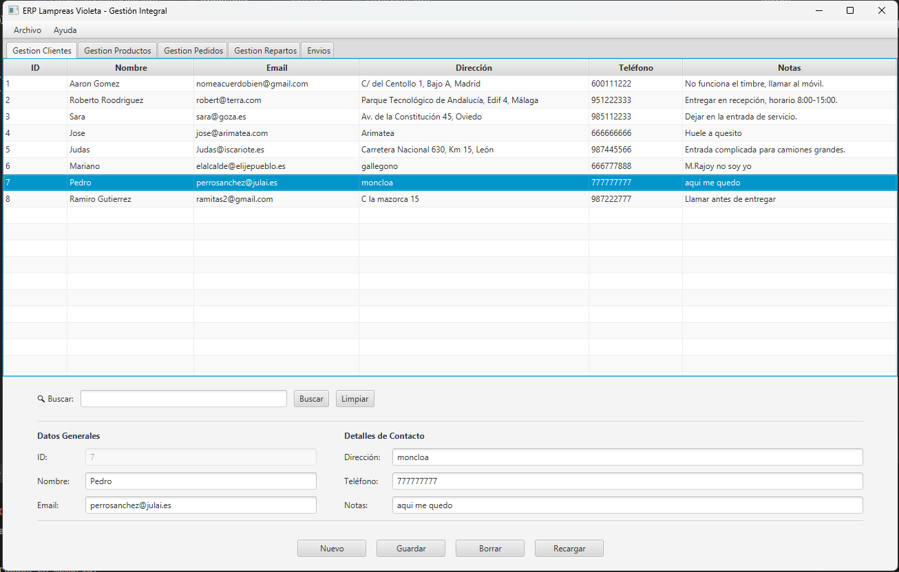
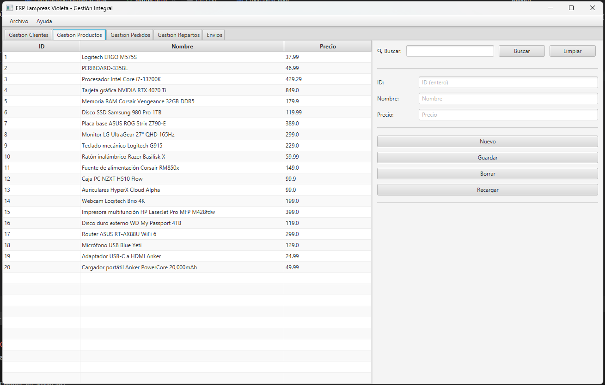
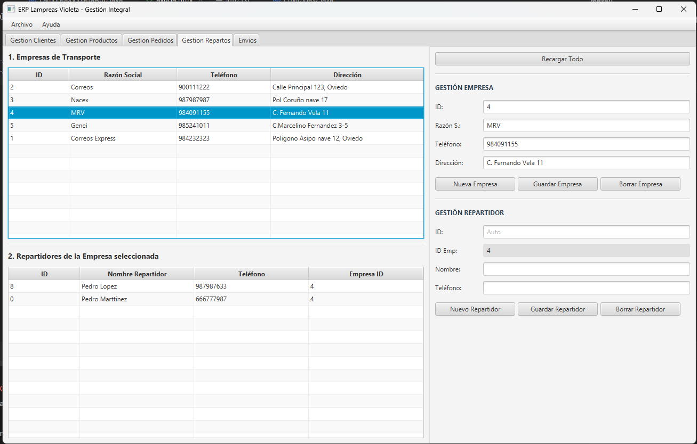
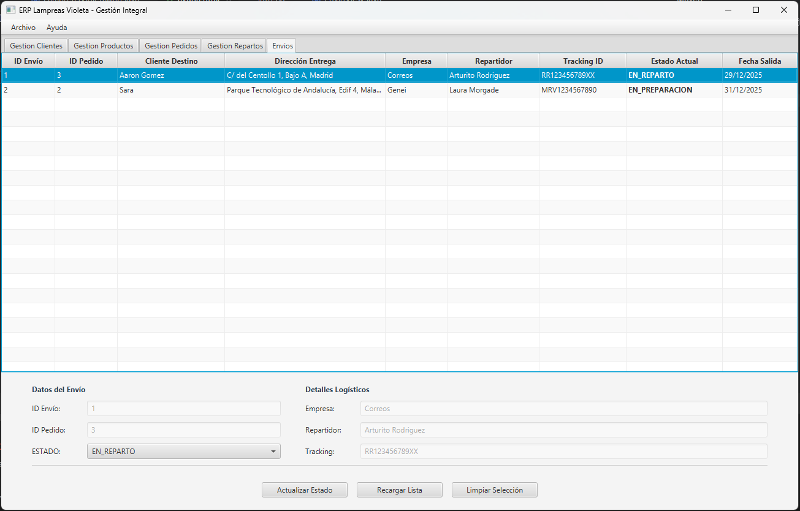

# 🐙 Lampreas Violeta - ERP de Gestión Logística

**Lampreas Violeta** es una aplicación de escritorio robusta desarrollada en JavaFX para la gestión integral de procesos logísticos. El sistema administra el ciclo de vida completo: desde el alta de clientes y gestión de inventario, hasta la creación de pedidos y el seguimiento en tiempo real de los envíos mediante flotas de reparto.

---

## 🚀 Funcionalidades Principales

### 👤 Gestión de Clientes (Maestro-Detalle)
* **Interfaz Dividida:** Visualización eficiente con panel dividido (35%/65%) para editar datos generales y detalles de contacto simultáneamente.
* **Histórico:** Persistencia de direcciones y notas asociadas.
* **Búsqueda:** Filtrado en tiempo real por ID, nombre o email.

### 🛒 Pedidos y Productos
* **Control de Stock:** Gestión de catálogo de productos con precios unitarios.
* **Integridad de Datos:**
    * **Bloqueo Automático:** Los pedidos pasan a estado **"Solo Lectura"** una vez que se genera su envío, impidiendo modificaciones accidentales en líneas de pedido ya procesadas.
    * **Cálculos Dinámicos:** Actualización automática de importes totales en la vista.

### 🚚 Logística y Envíos
* **Gestión de Flotas:** Administración de Empresas de Reparto y sus Repartidores asociados. Cascada de datos y validación de dependencias.
* **Workflow de Envíos:** Control de estados (`EN_PREPARACION` ➔ `EN_REPARTO` ➔ `ENTREGADO` ➔ `INCIDENCIA`).
* **Snapshot de Datos:** Al crear un envío, el sistema guarda una "foto" estática de la dirección del cliente y los datos del repartidor. Si el cliente se muda en el futuro, el registro histórico del envío permanece inalterado.

### 💾 Sistema de Respaldo (Backup JSON)
Sistema avanzado de Importación/Exportación transaccional (ACID):
* **Exportar:** Serialización completa de la base de datos a formato JSON.
* **Importar (Safe Mode):**
    1. **Carga en Memoria:** Previsualización de datos en la interfaz sin tocar la base de datos.
    2. **Restauración Transaccional:** Al confirmar, se realiza un *wipe* completo de la BD, se reinsertan los datos y se sincronizan las secuencias (`SERIAL`). Si ocurre un error, se ejecuta un **ROLLBACK** automático.

---

## 🛠️ Stack Tecnológico

* **Lenguaje:** Java 17 (OpenJDK)
* **Interfaz Gráfica:** JavaFX (FXML, CSS, WebView para ayuda integrada).
* **Base de Datos:** PostgreSQL.
* **Persistencia:** JDBC Nativo con Patrón DAO (Data Access Object).
* **Librerías:**
    * `com.fasterxml.jackson`: Procesamiento JSON.
    * `jackson-datatype-jsr310`: Soporte para fechas `LocalDate`.
* **Arquitectura:** MVC (Modelo-Vista-Controlador) con Servicios de Negocio.

---

## ⚙️ Configuración e Instalación

### 1. Requisitos
* JDK 17 o superior.
* PostgreSQL instalado y en ejecución.

### 2. Base de Datos
Crea una base de datos vacía en PostgreSQL y ejecuta el script de esquema:

> CREATE DATABASE violeta_db;

*Nota: Ejecuta el script `schema.sql` (ubicado en `src/main/resources/sql/`) para crear las tablas necesarias.*

### 3. Variables de Entorno (Opcional)
La aplicación busca primero variables de entorno para la conexión. Si no se encuentran, usa valores por defecto.

> **PG_HOST**: localhost
> **PG_PORT**: 5432
> **PG_DB**: violeta_db
> **PG_USER**: violeta_user
> **PG_PASS**: violeta_1234

### 4. Ejecución
Para evitar problemas con la carga de módulos JavaFX, ejecuta siempre desde la clase lanzadora:

> app.Launcher

---

## 📸 Capturas de Pantalla

| Gestión de Clientes | Gestión de Productos | Gestión de Pedidos | Gestión de Logística | Gestión de Envíos | 
|:---:|:---:||:---:||:---:||:---:|
|  |  |  |  |  |

---

## 📂 Estructura del Proyecto

> src/main/java
> ├── app/             # Launcher y Main App
> ├── dao/             # Data Access Objects (SQL)
> ├── db/              # Gestión de Conexión (Singleton)
> ├── model/           # POJOs (Cliente, Envio, etc.)
> ├── services/        # Lógica de Negocio (AlmacenData, JsonService)
> └── view/            # Vistas JavaFX (AdminLogisticaView, EnvioDialog...)

---

## 🤝 Contribución

1. Haz un Fork del proyecto.
2. Crea una rama (`git checkout -b feature/NuevaFuncionalidad`).
3. Haz Commit (`git commit -m 'Añadida nueva funcionalidad'`).
4. Haz Push (`git push origin feature/NuevaFuncionalidad`).
5. Abre un Pull Request.

---

**Desarrollado con ❤️ para el Proyecto Lampreas Violeta**
